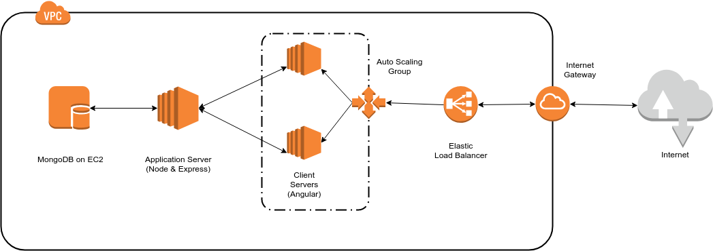
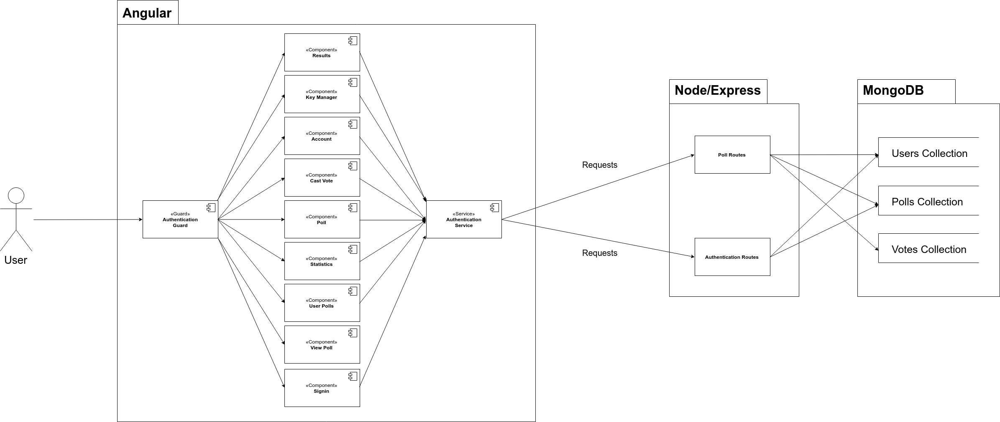
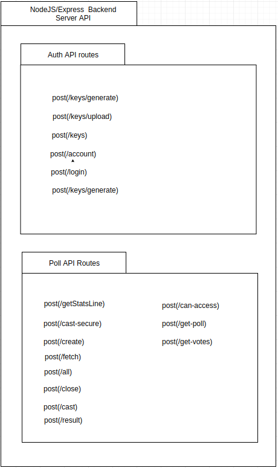
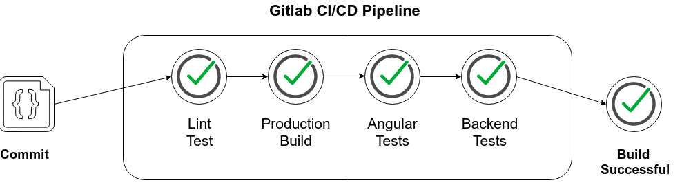

__Student Name__: Jake Grogan

__Student Name__: Martynas Urbanavicius

__Supervisor__: Stephen Blott

__Date__: 8th March 2019

---

# Elect Technical Manual

## 0 - Table of Contents

1. Introduction
   - 1.1 - Overview
   - 1.2 - Glossary
2. System Architecture
   - 2.1 - Language Choices
   - 2.2 - High-Level Architecture
3. High-Level Design
   - 3.1 Initial Design
   - 3.2 Current Design
4. Problems and resolution
5. Installation Guide
   - Front-end Installation
   - Back-end Installation
   - Database Installation
6. Testing
   - 6.1 Front-End Testing
   - 6.2 Back-End Testing
   - 6.3 User Tests

## 1 - Introduction

### 1.1 - Overview

---

The idea for this project came about after this years Redbrick EGM, we noticed a problem. When people were voting to elect new committee members, all the votes had to be written on paper then tallied up. This was a long and arduous process to sit through. We assume Redbrick are not the only society which face this issue.

We propose a system that will combat this problem. The premise of this web application is to allow clubs, societies, groups and organisations to carry out votes for elections. Users who wish to conduct a vote or election will also have the option to digitally sign the votes, giving them peace of mind that whoever said they voted, did. Once a vote is created, the creator is given a unique, shareable url that may be distributed to whoever they wish to participate in the vote. Results will be available to voters and statistics available to the poll creators in the form of charts and graphs. 

You can think of this as the Doodle for voting and elections.

### 1.2 - Glossary

---

- __MongoDB__: MongoDB is a free open-source cross-platform document-oriented database program. Classified as a NoSQL database program, MongoDB uses JSON-like documents with schemata.

- __Angular__: Angular is a TypeScript based open-source front-end web application platform.

- __TypeScript__: TypeScript is an open-source programming language developed and maintained by Microsoft. It is a strict syntactical superset of Javascript, and adds optional static typing to the language.

- __Node.JS__: Node.JS is an open-source, cross-platform JavaScript run-time environment that executes JavaScript code outside of a browser. Node.JS allows developers use JavaScript to write command line tools and server-side scripts.

- __Express.JS__: Express.js is an open source web application framework for Node.js. It is designed for building we applications and APIs.

- __HTML__: Hypertext Markup Language is the authoring language used to create documents on the web.

- __Bootstrap__: Bootstrap is an open source front end framework for websites and web applications.

- __AWS__: AWS (Amazon Web Services) is Amazon's cloud computing platform. It provides on-demand, elastic computing services to organizations and individuals.

- __VPC__: VPC (Virtual Private Cloud) is "Your own data center in the cloud". VPC lets you provision a logically isolated section of the AWS Cloud where you can launch AWS resources in a virtual network that you define. VPC provides complete control over your virtual networking environment, including selection of your own IP address range, creation of subnets, and configuration of route tables and network gateways.

- __EC2__: AWS Elastic Compute Cloud (EC2) is a web service that provides secure, resizable compute capacity in the cloud.

- __OpenPGP__: Open PGP is an open source implementation of PGP. Pretty Good Privacy (PGP) is an encryption program that provides cryptographic privacy and authentication for data communication. PGP is used for signing, encrypting, and decrypting texts, e-mails, files, directories, and whole disk partitions and to increase the security of e-mail communications. This is under RFC 4880

- __Digital Signatures__: A digital signature is a mathematical scheme for verifying the authenticity of digital messages or documents.

## 2. System Architecture

### 2.1 - Language Choices

---

For this project we decided on using the MEAN Stack. The MEAN stack uses MongoDB, Express.js, Angular and Node.js to build scalable, fullstack web applications. We decided to use this stack as javascript stacks are quickly becoming the norm for building modern web application. The fact that Javascript is used across the entire stack also makes working with the stack far more simplistic which benefits us as we were unfamiliar with most of the technologies used on this project in the beginning.

This stack is also very easy to pick up once you are familiar with javascript.

We chose Angular 6 as it was the latest release of Angular at the time of starting this project (Angular is now on version 7). We are using node version 8 as it is an LTS (Long term support) version. We are using the latest versions of MongoDB and Express.

### 2.2 System Architecture

---

#### Operational Environment

---

#### Component Dataflow

---

#### Backend Routes

## 3. High-Level Design

### 3.1 Initial Design

---

The target audience will be societies, clubs, students and other organisations/groups who wish to conduct a vote and don't have their own system to do it.

The application will be hosted on AWS. We will set up a VPC with both public and private facing subnets. The front-end will be accessible through these public subnets. The back-end and database will be hosted on EC2 Linux instances in the private facing subnets. There will be an elastic load balancer in front of the public subnet which will distribute the traffic to the public facing server fleet.
These public facing servers will be placed in an auto-scaling group and will horizontally scale based on certain server metrics. The front-end will be developed using Angular 6. The back-end will be developed with Express.js, on top of a Node.js server. We have decided to use MongoDB as our database as the data is not strongly related and our stack is javascript so storing JSON like objects makes sense.

With most web applications, they should be prepared to deal with high user volume and growth. With this application we have potential scenarios such as a celebrity creating some type of poll and sharing that with hundreds of thousands, potentially millions, of people. Although unlikely for this project, we still need to design our system in such a way that it can scale to that level with little trouble. This is where AWS comes in.
Thanks to the elastic nature of most AWS services, we have no trouble scaling to meet these demands. Our front-end and back-end application servers will be placed in auto-scaling groups. This allows us to set triggers to start horizontally scaling our servers out to handle an increase in load. These triggers will be based on server metrics such as CPU utilization.
We can also create read replicas of our mongoDB instance. This allows us to hand off read requests to these instances during times of high load.

Security is of utmost importance on the web. We can't afford data leaks, or be open to potential hacks.
Our application servers and databases will be in a private subnet that will only be able to be accessed through servers in the public subnets. We can restrict what IP addresses can access these servers.
We can also set up security groups and network access control lists. The security groups will act on an instance basis while the NACLs will act on a subnet basis. This adds an extra layer of protection to both servers and subnets.
Placing servers in autoscaling groups also helps mitigate against DDoS attack
The use of AWS Identity & Access Management (IAM) gives us fine-grained access to our AWS resources. We can enable multi-factor authentication on users associated with the project to add an additional layer of security so that if anyone trys to access our resources via API calls or through the management console they will need to use 2FA.

### 3.2 - Current Design

---

The main problem was the amount of features we said we would have implemented in the final version. We discovered during development that although the features we had planned to include in the final release sounded relatively simple and straightforward to implement actually took some time. There were a lot more moving parts than we had first expected. 

Due to this we have had to cut back some of the features we planned on implementing. We have only included a single vote type in the final release. However, we have designed how adding extra voting types is done in such a way as to make it much more straight forward than the first implementation of a voting type.

Some other features such as IP duplication checking and displaying who voted have also been removed due to data protection and privacy concerns.

Everything else including the operational environment remains unchanged.

## 4. Problems and Resolution

- When generating encryption keys, we faced some issues with the javascript implementation of openpgp. As a result of openpgp being implemented in javascript it was slower compared to implementations in other languages. To work around this we have had to resort to generation 1024 bit keys as opposed to 2048 bit keys we had originally planned.

- When signing the votes we faced some issues with how vote signing should be implemented. The first issues was the documentation for the openpgpjs library. It wasn't very clear as to how things should be done. With some messing around with documentation from previous versions and playing with some of the configurable options for signing, we managed to get it working.

- When verifying the signed votes on the backend we faced some issues too. These were mainly caused by the asynchronous nature of Node.JS. We did not have to worry about asynchronous function calls on the front-end. On the backend, this was an issue and we had to design the code in such a way as to cater for these asynchronous calls. This has led to a waterfall style of code in which vote verification has had to happen in the callback function of the vote decryption.

- Problems arose when attempting to display vote results and statistics as charts. When the statistics component (or result component) is initialized, a call is made to fetch the data necessary to generate the graphs from the back-end. The line chart was not updating appropriately when the data arrived at the front end whereas the doughnut chart was updating perfectly fine. We soon discovered this was an issue a lot of others using the library faced. To combat this we fetched the data for the line chart before the doughnut chart. This has seemed to fix the issue. We are still unaware as to why this was causing problems.

- When deploying to AWS, we found that if either the front-end or back-end servers encountered an error, they were not able to recover. This would in turn cause our load balancers health checks on the front-end server to fail and cause the entire site to go down. This is a problem we never experienced while testing locally. To combat this we needed some way of automatically restarting a server if it encountered an error. We found a library called pm2 worked well for us. Pm2 is an advanced production process manager for Node.js. Pm2 monitors processes (Node.js web apps in this case) and will automatically restart them when they exit unexpectedly. As a result our load balancers health checks are no longer failing and the site has a higher availability.

## 5. Installation Guide

This application was designed for Ubuntu 18.04. It has been tested on Ubuntu 16.04 and also appears to be stable on Windows 10.

You will need to have Node.js version 8.10 and NPM (Node package manager) installed before continuing. You will also need to install Angular CLI v6 and express generator.

To Install Node.js and NPM follow the steps below:

- Add Node.js PPA
  - `sudo apt install curl`
  - `curl -sL https://deb.nodesource.com/setup_8.x | sudo bash -`
- Install Node.js and NPM
  - `sudo apt install nodejs@8.10`
  - Verify installation using `node -v` and `npm -v`

To install Angular CLI follow the steps below:

- Install Angular CLI version 6.1.5
  - `npm install -g @angular/cli@6.1.5`

To install Express generator follow the steps below:

- Install express generator v4.16
  - `npm install -g express-generator`

### Client Installation

---

1. In the client directory,run `npm install`. This will install all dependencies for the client application.
2. Ensure your services will be contacting a local instance of the back-end by updating the `apiUrl` and `apiAuth` values in `./src/app/config/api-config.ts`

2. Run `ng serve` in the client directory. This will start a development server. Navigate to `http://localhost:4200/`. The app will automatically reload if you change any of the source files.

3. [OPTION] If you want to build the client for production, run `ng build --prod --base-href ./`.
4. [OPTION] If you want to run unit tests, run `ng test`

### Server Installation

---

1. In the server directory, run `npm install`. This will install all dependencies for the server application.
2. Run `npm start`. This will start the application at `http://localhost:3000/`.
3. Ensure you are connecting to the correct MongoDB by updating the mongoose connection string in `app.js`.
4. [OPTION] To run unit tests, you will need to configure mongoose to connect to a remote MongoDB instance ("mongodb://34.241.192.136:27017"). The reason for this is, we need a test account as we will need to generate an authorization token and encryption keys. Having a test account on a remote database has removed some major issues encountered with testing. To run the tests, run `npm test ./tests`

### Database Installation

---

To install MongoDB follow the steps below:

- Import the MongoDB repository:
  - `sudo apt-key adv --keyserver hkp://keyserver.ubuntu.com:80 --recv 68818C72E52529D4`
  - Create a source list file for MongoDB `sudo echo "deb http://repo.mongodb.org/apt/ubuntu bionic/mongodb-org/3.6 multiverse" | sudo tee /etc/apt/sources.list.d/mongodb-org-3.6.list`

- Update the repository
  - `sudo apt-get update`
- Install the MongoDB packages
  - `sudo apt-get install -y mongodb-org=3.6 mongodb-org-server=3.6 mongodb-org-shell=3.6 mongodb-org-mongos=3.6 mongodb-org-tools=3.6`

- Launch MongoDB as a service
  - `sudo systemctl start mongod`
  - `sudo systemctl enable mongod`

- Check that MongoDB has been started on port 27017 
  - `sudo netstat -plntu`

If you have experienced any issues installing dependencies, please check the following links for troubleshooting:

- Angular CLI - https://cli.angular.io/

- Node.js - https://nodejs.org/en/
- Express Generator - https://expressjs.com/en/starter/generator.html
- MongoDB - https://www.howtoforge.com/tutorial/install-mongodb-on-ubuntu/

The application should be up and running. 

## 6. Testing

### 6.1 - Front-End Testing

---

When testing the front end we ran into a couple of minor issues and as a result we have done a mix of unit testing and manual adhoc testing. 

The issue was OAuth. We are using a wrapper around OAuth to make the Google signin process in angular as simple as possible. 

For unit tests we check that each component loads and initialises data correctly. These tests may be run using `ng test`.

In terms of coverage, we have 100% component coverage. 

We have 12 unit tests in total and use Jasmin and Karma to write and run our unit tests. These frameworks come with angular. 

Unit tests for each component can be found in the _name_.component.spec.ts file in each component directory.

As of current, all unit tests are passing.

### 6.2 - Back-End Testing

---

When testing the backend we also ran into issues which were discussed in the installation guide. We needed to set up a test account on a remote mongoDB instance.

For unit tests we test each route with both positive and negative test cases. The tests check that the expected responses and data are returned based on what data was in the request to the route.

In terms of coverage, we have ~90% coverage for the routes.

We have 22 unit tests in total for the back-end and use supertest for mocking requests to the route as well as chai and mocha for writing and running the tests cases.

Unit tests can be found in the tests folder.

As of current, all unit tests are passing.

### 6.3 - User Tests

---

We also believed that getting feedback from users was equally important. The aim of the user tests was to gain an understanding of the usability of the system as well as how accessible it is.

To do this we set up a user test account and invited participants to carry out a set of scenarios that covered the systems main functions. We then gave the participants a short anonymous questionnaire. 

The results of this are as follows and marked out of 5:

Trying to log in: 5/5

Create a non-secure poll: 4.5/5

Cast a vote on the non-secure poll: 4.5/5

Viewing and understanding vote results: 5/5

Viewing the polls statistics: 5/5

Generating your encryption keys: 3/5

Creating a secure poll: 4/5

Voting on a secure poll: 4/5

### 6.4 - CI/CD

---

We have a continuous integration pipeline set up on the Gitlab repository. There are four stages to the pipeline.

1. Lint tests
   - In this stage, our front end angular code is put through lint tests to make sure the code follows style guides. This helps us keep our code consistent from developer to developer
2. Build stage
   - In this stage we build the client code for production. We deemed this necessary to do each time as Angular has a habbit of running fine on a dev server but failing to build for production
3. Angular unit tests
   - In this stage we run our angular unit tests, the details of which can be found in section 6.1
4. Backend unit tests
   - In this stage we run our backend unit tests, the details of which can be found in section 6.2

